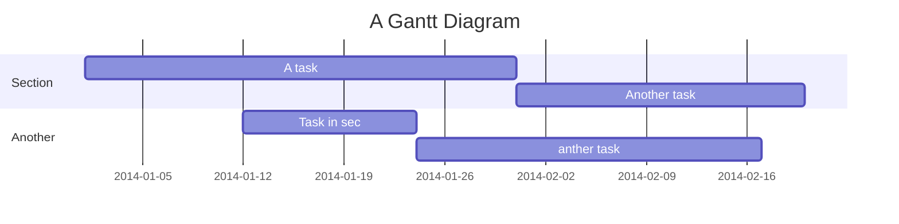

<h1 style="font-family:Impact">Golang使用cobra CLI</h1>

> [time=Mon, Jan 11, 2021 9:29 PM] [name=Sheng Lai] 

tag: <b>`go` `cobra`</b>


<br>
<br>
<!-- 

 -->

 
建立 `k8s-deploy-cobra` 專案目錄，並進入目錄初始化modules

```
$ mkdir k8s-deploy-cobra && cd k8s-deploy-cobra

$ go mod init k8s-deploy-cobra
go: creating new go.mod: module k8s-deploy-cobra
```
執行完目錄下會多一個`go.mod`檔案，尚未安裝`cobra`，執行以下指令進行安裝
```
$ go get -u github.com/spf13/cobra/cobra
```


User story
---

```gherkin=
Feature: Guess the word

  # The first example has two steps
  Scenario: Maker starts a game
    When the Maker starts a game
    Then the Maker waits for a Breaker to join

  # The second example has three steps
  Scenario: Breaker joins a game
    Given the Maker has started a game with the word "silky"
    When the Breaker joins the Maker's game
    Then the Breaker must guess a word with 5 characters
```
> I choose a lazy person to do a hard job. Because a lazy person will find an easy way to do it. [name=Bill Gates]


```gherkin=
Feature: Shopping Cart
  As a Shopper
  I want to put items in my shopping cart
  Because I want to manage items before I check out

  Scenario: User adds item to cart
    Given I'm a logged-in User
    When I go to the Item page
    And I click "Add item to cart"
    Then the quantity of items in my cart should go up
    And my subtotal should increment
    And the warehouse inventory should decrement
```

> Read more about Gherkin here: https://docs.cucumber.io/gherkin/reference/

User flows
---
```sequence
Alice->Bob: Hello Bob, how are you?
Note right of Bob: Bob thinks
Bob-->Alice: I am good thanks!
Note left of Alice: Alice responds
Alice->Bob: Where have you been?
```

> Read more about sequence-diagrams here: http://bramp.github.io/js-sequence-diagrams/

Project Timeline
---


> Read more about mermaid here: http://mermaid-js.github.io/mermaid/

## Appendix and FAQ

:::info
**Find this document incomplete?** Leave a comment!
:::

###### tags: `Templates` `Documentation`
